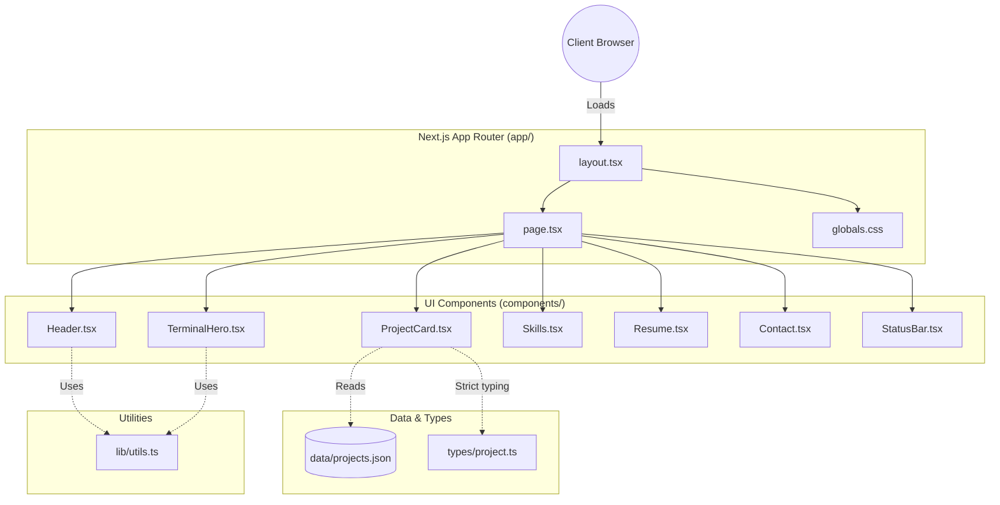
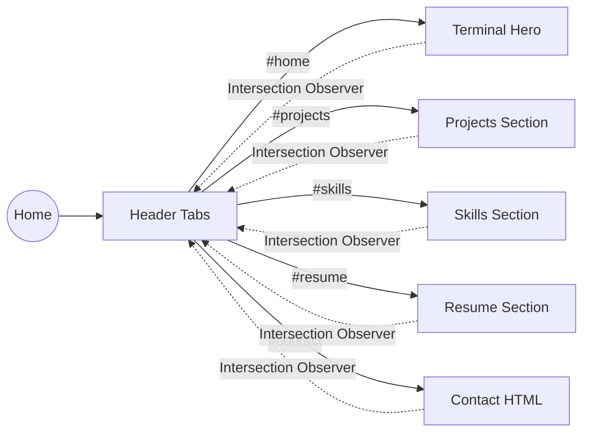

<div align="center">

# Akash Debbarma — Developer Portfolio

**An interactive, code-editor-inspired portfolio for an Aspiring AI Engineer.**

[](https://nextjs.org/)
[](https://www.typescriptlang.org/)
[](https://tailwindcss.com/)
[](https://vercel.com/)
[](https://opensource.org/licenses/MIT)

[View Live Demo](https://akash-portfolio-iotarosy.vercel.app/) • [Report Bug](https://github.com/akashdebbarma06/akash-portfolio-new/issues) • [Request Feature](https://github.com/akashdebbarma06/akash-portfolio-new/issues)

</div>

---

## 📺 Live Demo & Preview

> **Note to self:** Add a GIF screen recording of the terminal typing animation and smooth scrolling navigation here (`./public/demo.gif`).


---

## 🏗️ Project Architecture



---

## 🗺️ Navigation Flow



---

## ✨ Features

| Feature | Description | Status |
|---------|-------------|--------|
| **Terminal Hero** | Bash-style typing animation mirroring an interactive shell. | 🟢 Active |
| **Hash Navigation** | Smooth auto-scrolling with `IntersectionObserver` active state highlighting. | 🟢 Active |
| **IDE Aesthetics** | Strict Obsidian-style dark mode, monospace typography, and sharp edges. | 🟢 Active |
| **Dynamic Cards** | Project showcase featuring mock IDE file-tabs (e.g., `.ts`, `.py`). | 🟢 Active |
| **Resume Preview** | LaTeX-editor inspired split-screen view for the live resume. | 🟢 Active |
| **Interactive HTML** | Contact section formatted as a clickable, copyable `contact.HTML` file. | 🟢 Active |

---

## 🛠️ Tech Stack

| Category | Technology | Purpose |
|----------|------------|---------|
| **Framework** | [Next.js (App Router)](https://nextjs.org/) | Server-side rendering, routing, and fast initial loads. |
| **Language** | [TypeScript](https://www.typescriptlang.org/) | Strict type-safety, specifically for project data structures. |
| **Styling** | [Tailwind CSS v4](https://tailwindcss.com/) | Rapid utility-first styling without external component libraries. |
| **Fonts** | [next/font](https://nextjs.org/docs/app/building-your-application/optimizing/fonts) | Self-hosted, optimized `Inter` (Sans) and `IBM Plex Mono` (Code). |
| **Deployment**| [Vercel](https://vercel.com/) | Edge network hosting with seamless CI/CD integration. |

---

## 🚀 Getting Started

### Project Structure
```text
akash-portfolio/
├── app/
│   ├── globals.css      # Core theme, variables, animations
│   ├── layout.tsx       # Root HTML structure, font loading
│   └── page.tsx         # Main single-page composition
├── components/          # Reusable UI sections
│   ├── Contact.tsx
│   ├── Container.tsx
│   ├── Header.tsx
│   ├── ProjectCard.tsx
│   ├── Resume.tsx
│   ├── Skills.tsx
│   ├── StatusBar.tsx
│   └── TerminalHero.tsx
├── data/
│   └── projects.json    # Static project content
├── lib/
│   └── utils.ts         # Shared logic (scrollToSection)
├── public/              # Static assets (PDFs, Images, Favicon)
└── types/
    └── project.ts       # TypeScript interfaces
```

### Installation

1. **Clone the repository:**
   ```bash
   git clone https://github.com/akashdebbarma06/akash-portfolio-new.git
   cd akash-portfolio-new
   ```

2. **Install dependencies:**
   ```bash
   npm install
   ```

3. **Start the development server:**
   ```bash
   npm run dev
   ```

4. Open [http://localhost:3000](http://localhost:3000) in your browser.

---

## ☁️ Deployment (Vercel)

This project is optimized for deployment on Vercel. 

1. Push your code to a GitHub repository.
2. Go to the [Vercel Dashboard](https://vercel.com/new).
3. Import the repository and leave the framework preset as **Next.js**.
4. Click **Deploy**.

> *There are currently no required environment variables (`.env`) for this static portfolio.*

---

## 📫 Contact

[](https://github.com/akashdebbarma06)
[](https://www.linkedin.com/in/akashdebbarma06/)
[](https://leetcode.com/u/akashdebbarma06/)

