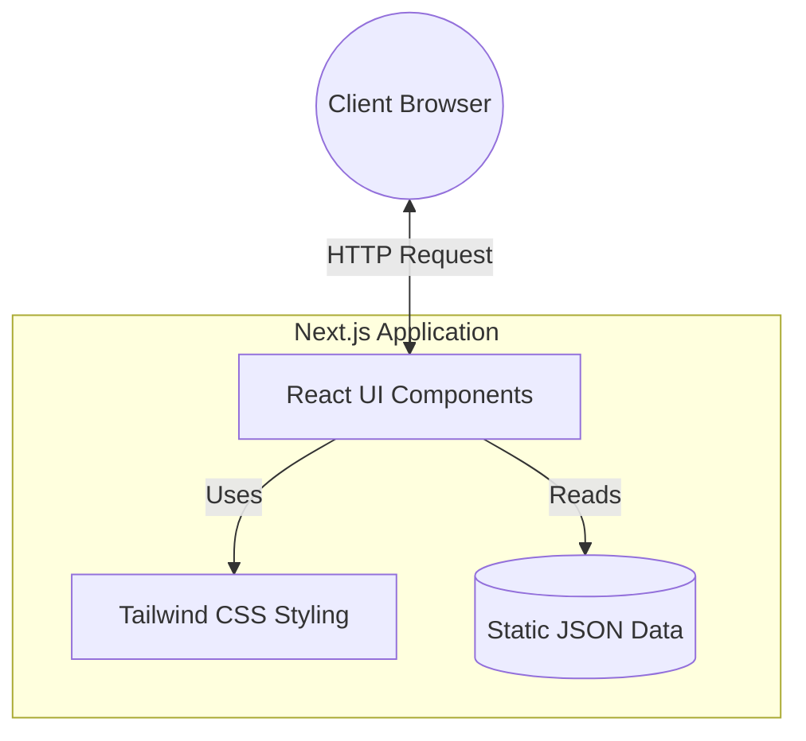

# Akash Debbarma — Developer Portfolio

A personal portfolio designed as an interactive, terminal-inspired code editor. Built to showcase full-stack and AI/ML projects alongside competitive programming achievements.

## 🚀 Quick Start

First, install dependencies and run the development server:

```bash
npm install
npm run dev
```

Open [http://localhost:3000](http://localhost:3000) with your browser to see the result.

## 🏗️ Architecture



## ✨ Features

- **Terminal Hero Section**: Features a dynamic, animated typing effect mirroring a real shell interface.
- **Project Showcase**: File-style project cards with dynamic status tags (Live vs In Progress).
- **Interactive Navigation**: Hash-based smooth scrolling with an Intersection Observer for active tab highlighting.
- **Code-Editor Aesthetics**: Obsidian-style dark mode, monospace typography, and sharp, shadowless UI components.
- **Fully Responsive**: Mobile-first design ensures readability across all devices.

## 🛠️ Tech Stack

- **Framework**: [Next.js](https://nextjs.org/) (App Router)
- **Language**: [TypeScript](https://www.typescriptlang.org/)
- **Styling**: [Tailwind CSS](https://tailwindcss.com/)
- **Deployment**: Configured for edge environments

## 📫 Contact

- **GitHub**: [akashdebbarma06](https://github.com/akashdebbarma06)
- **LinkedIn**: [Akash Debbarma](https://www.linkedin.com/in/akashdebbarma06/)

